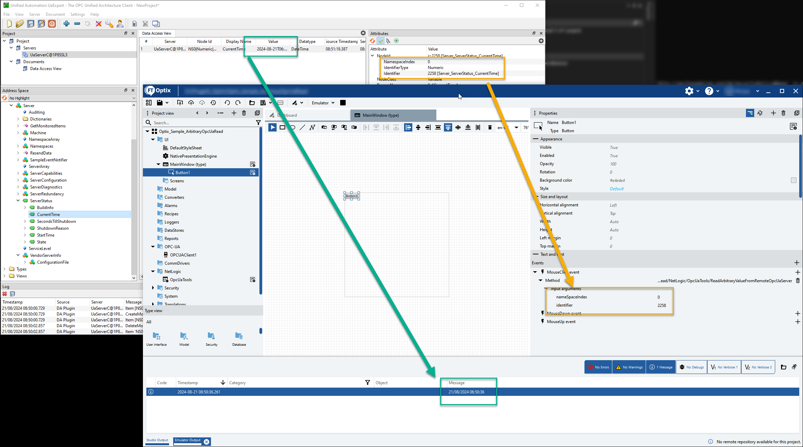

# Read arbitrary values from OPC/UA

This app shows how to read a value (or any attribute) from an OPC/UA server by knowing its NameSpaceIndex and Identifier

## Requirements

- OPC/UA Server from the UA Foundation: [Download](https://www.unified-automation.com/downloads/opc-ua-servers/opc-ua-ansi-c-demo-server.html)

## Sample screenshot

## Documentation

- Please see: [NetLogic Cheatsheet](https://github.com/FactoryTalk-Optix/NetLogic_CheatSheet/blob/main/pages/opcua.md)

## Disclaimer

Rockwell Automation maintains these repositories as a convenience to you and other users. Although Rockwell Automation reserves the right at any time and for any reason to refuse access to edit or remove content from this Repository, you acknowledge and agree to accept sole responsibility and liability for any Repository content posted, transmitted, downloaded, or used by you. Rockwell Automation has no obligation to monitor or update Repository content

The examples provided are to be used as a reference for building your own application and should not be used in production as-is. It is recommended to adapt the example for the purpose, observing the highest safety standards.
